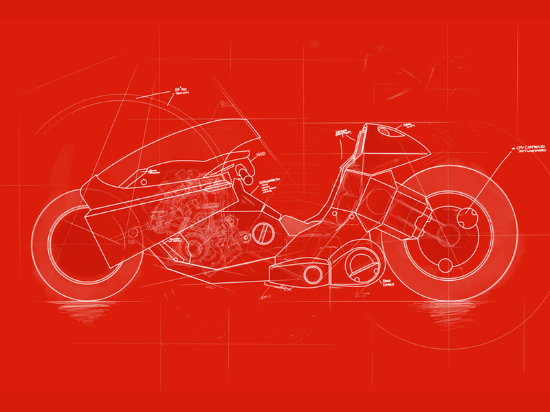
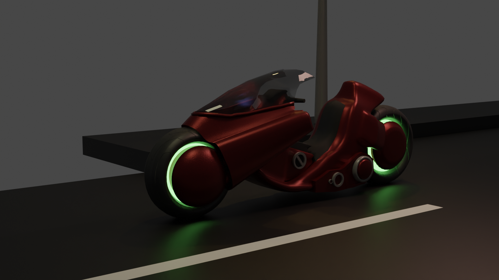
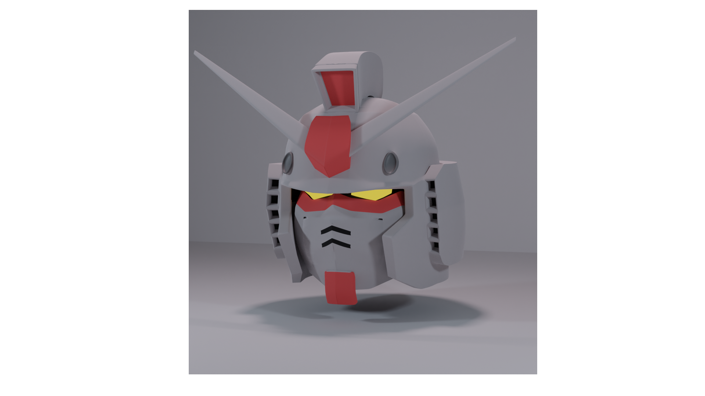
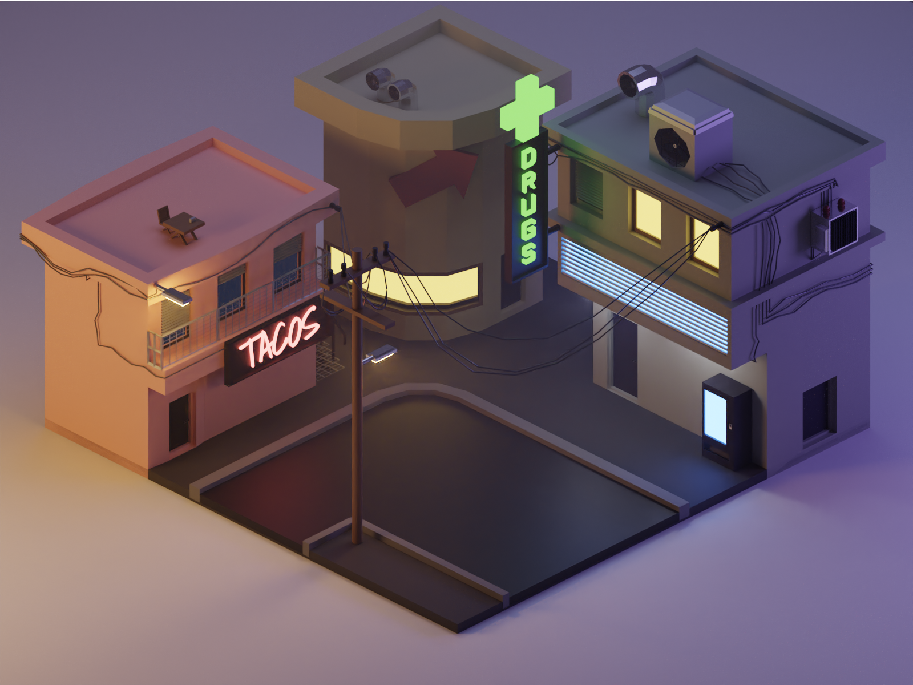
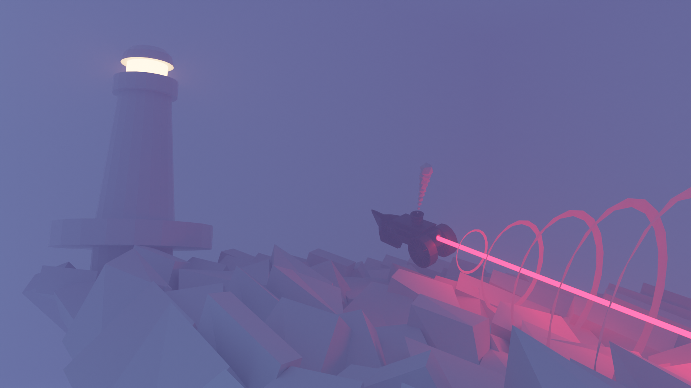

# Blender projects

## Akira's motorcycle
|    Blueprint used    |              Final render with textures              |
| :------------------: | :--------------------------------------------------: |
|  |  |

I was interested in learning new things such as **shader nodes** in blender 3.0, for example i  used **bump mapping** in the material node editor for the red metallic shell of the motorbike.

## Gundam mecha head

This is one of my first projects, i learnt **subdivision surfaces** in order to render smoother meshes and i enjoyed it a lot!

## Ortographic low poly city

This one is my first ever project, it taught me blender's **basics**, i did it following a tutorial video on [youtube](https://www.youtube.com/watch?v=9e7sqP_bVsY&ab_channel=PolygonRunway).

## Flying boat

In my last project i learnt how to use **geometry nodes** to create a more chaotic environment.